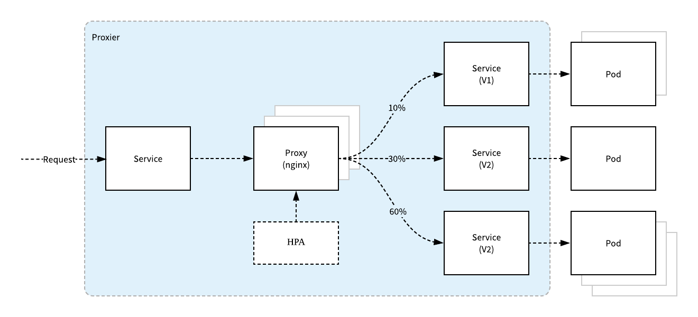

[](https://github.com/draveness/proxier/blob/master/LICENSE)
[](https://golang.org/)

# Proxier

Proxier is a better approach to expose applications in Kubernetes. It supports load balancing to a set of pods with weights and provides high-performance load balancing with nginx and HAProxy.

+ [x] supports canary deployment and load balancing by weight
+ [x] builtin load balancing applications support, ex: nginx and HAProxy
+ [ ] scales horizontally with pressure by default

```yaml
apiVersion: maegus.com/v1beta1
kind: Proxier
metadata:
  name: example-proxier
spec:
  ports:
    - name: http
      protocol: TCP
      port: 80
  selector:
    app: example
  backends:
    - name: v1
      weight: 90
      selector:
        version: v1
    - name: v2
      weight: 9
      selector:
        version: v2
```

## Architecture overview



## Installation

```
kubectl apply -f https://raw.githubusercontent.com/draveness/proxier/master/deploy/proxier.yaml
```

## Usage

## License

MIT License, see [LICENSE](./LICENSE)
